# VR Night Market 9 Grid (Cardboard VR 夜市九宮格)

<a href="./Assets/Project/Textures/icon.png" target="_blank">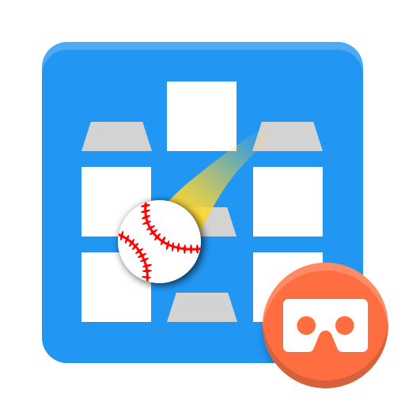</a>

# Screenshot
## Game Description
- 9 balls per round
- Hit a grid of 11 points
- All hit 100 points

<a href="./Screenshot/Game_Description.png" target="_blank">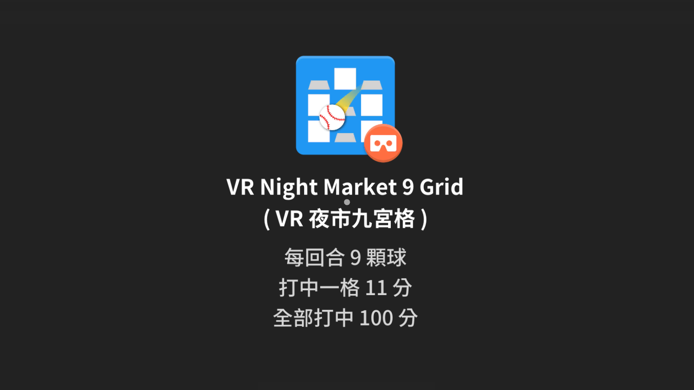</a>

## Main Menu
<a href="./Screenshot/Main_Menu.png" target="_blank">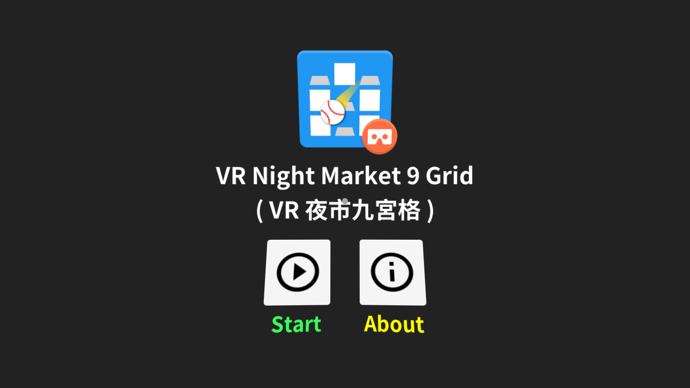</a>

### About
<a href="./Screenshot/Main_Menu_About1.png" target="_blank">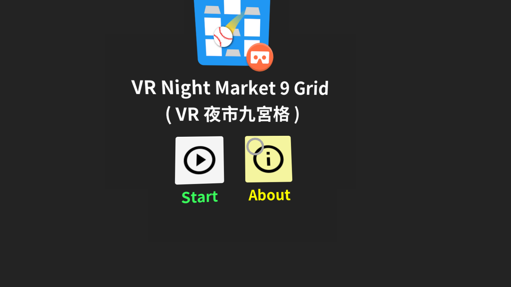</a>

<a href="./Screenshot/Main_Menu_About2.png" target="_blank">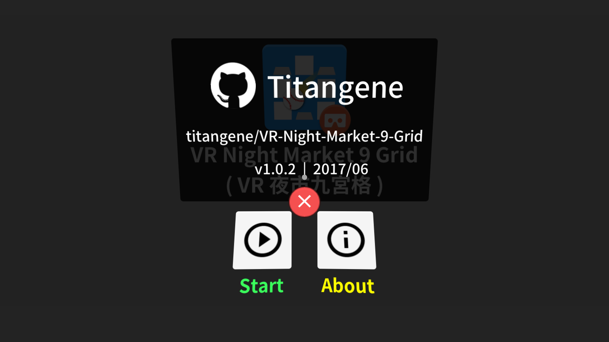</a>

### Start
<a href="./Screenshot/Main_Menu_Start.png" target="_blank">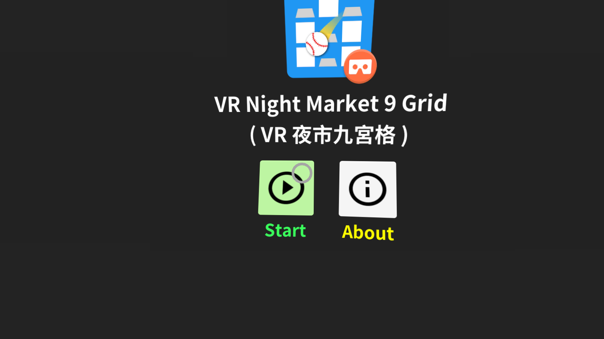</a>

## Game
### Prepare Timer
<a href="./Screenshot/Prepare_Timer.gif" target="_blank">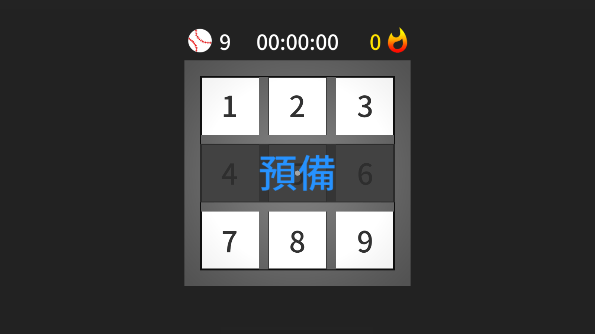</a>

### Grid
- Left : number of remaining balls
- Center : timer
- Right : score

<a href="./Screenshot/Game_Grid0.png" target="_blank">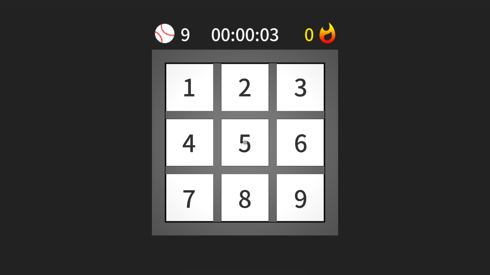</a>

<a href="./Screenshot/Game_Grid1.png" target="_blank">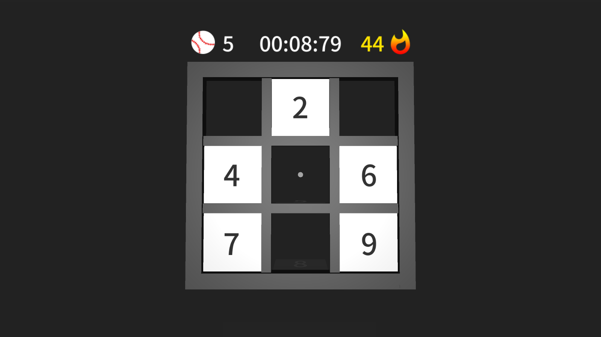</a>

### Hit the Grid & Flip the Grid 
<a href="./Screenshot/Game_Grid2.png" target="_blank">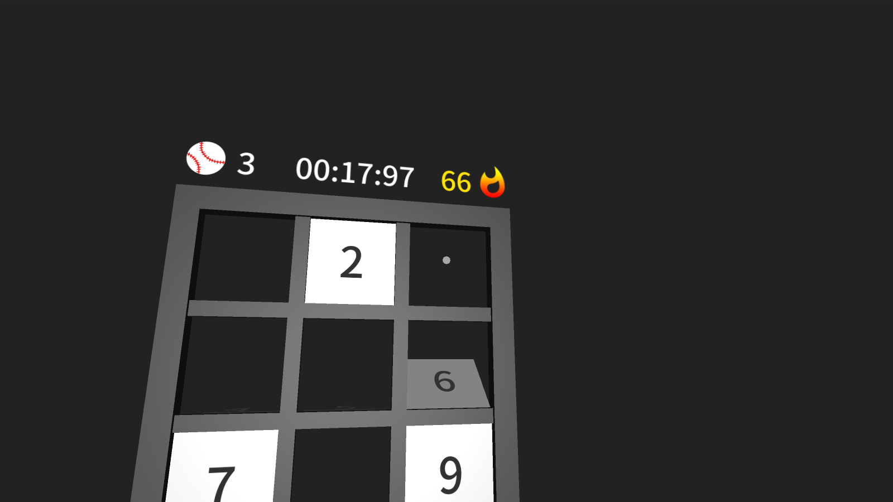</a>

<a href="./Screenshot/Game_Grid3.png" target="_blank">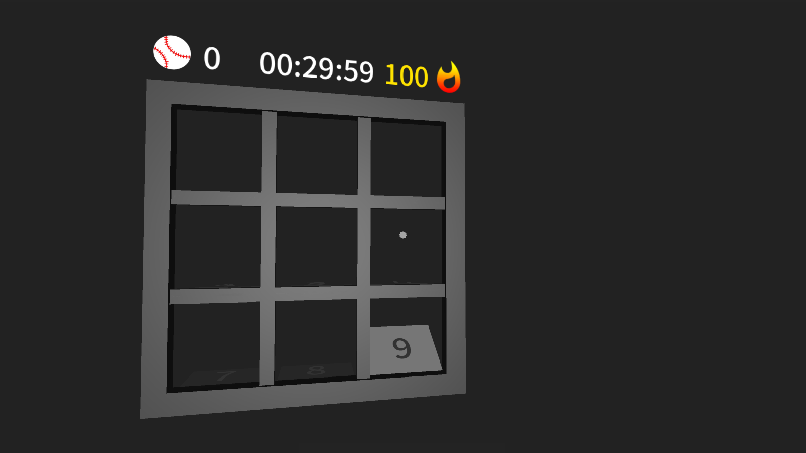</a>

## GameOver
<a href="./Screenshot/GameOver.png" target="_blank">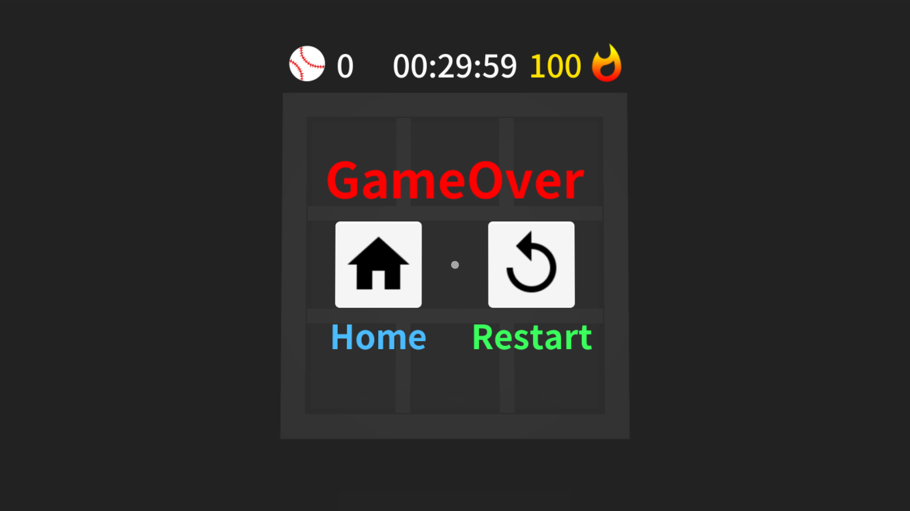</a>

### Restart
<a href="./Screenshot/GameOver_Restart.png" target="_blank">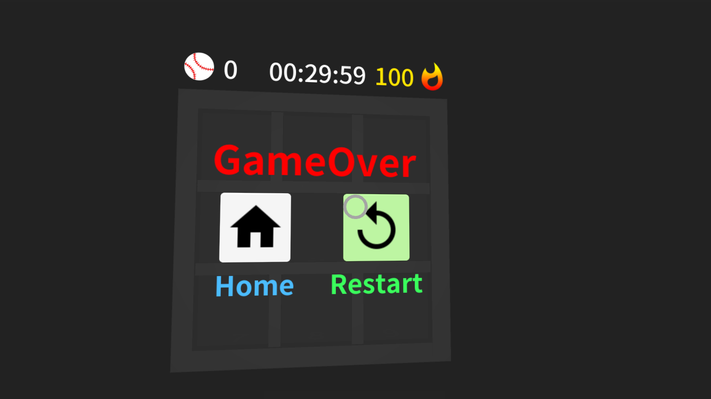</a>

### Home
<a href="./Screenshot/GameOver_Home.png" target="_blank">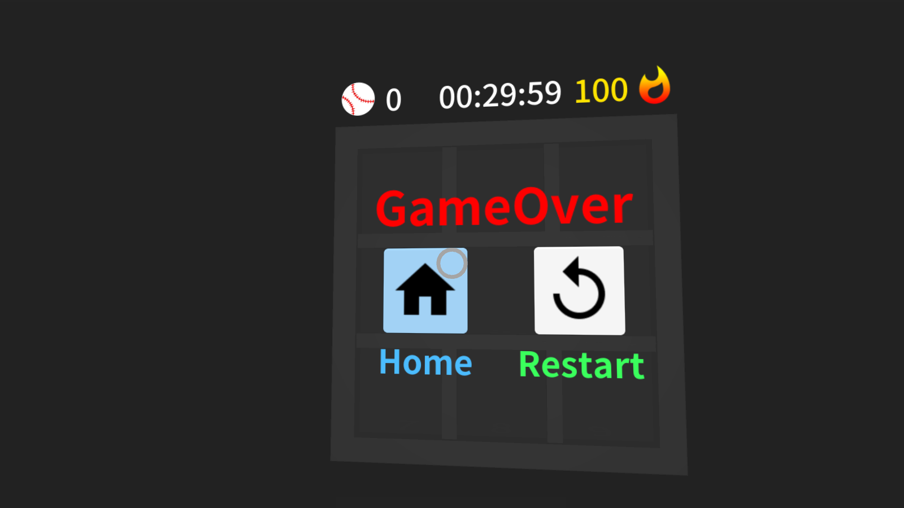</a>